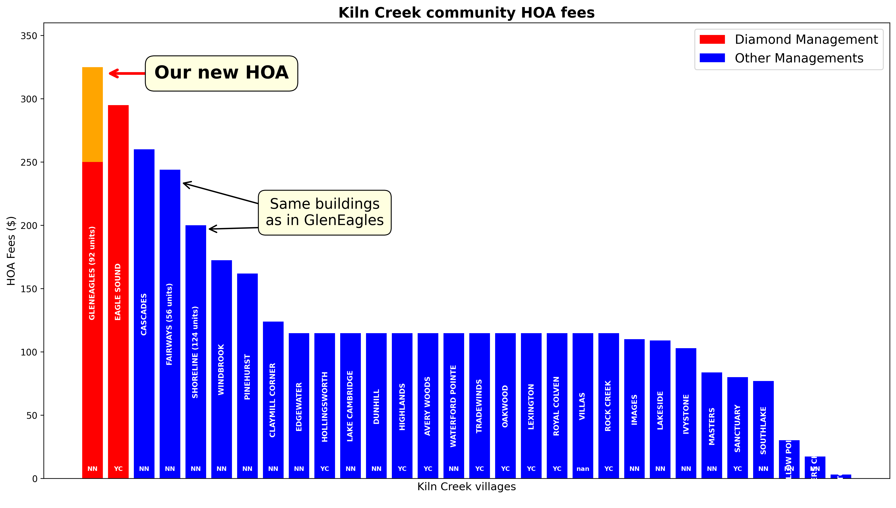

# gleneagles
Data science for board meeting

## Price Adjustments Between Original Documents and Data Table

### 1. Windbrook at Kiln Creek
The Kiln Creek master association documentation lists 36 units for
Windbrook with an HOA fee of $345. However, verification via Google Maps
reveals the community actually consists of 36 buildings with 2 units per
building, totaling 72 units. The $345 fee appears to be assessed per
building rather than per unit. When divided between the two units in each
building, the per-unit cost is $172.50. This interpretation is
corroborated by active Zillow listings showing individual unit HOA fees of
approximately $265, reflecting a price increase of about $12 per unit from
the documented rate. Adjusted calculation: $345 ÷ 2 = $172.50 per unit,
plus recent increases brings current rates to approximately $288 per unit
($172.50 + $115).

### 2. Glen Eagles
The HOA fee is marked as quarterly in source documents but is actually
paid monthly. Data has been adjusted to reflect the monthly payment
schedule.

### 3. The Cascades
The Condo Fee includes Water and Sewer utilities. To ensure accurate
comparison with other communities, the price has been corrected using
average values from comparable properties with similar apartment areas and
bathroom counts, excluding utility costs.
